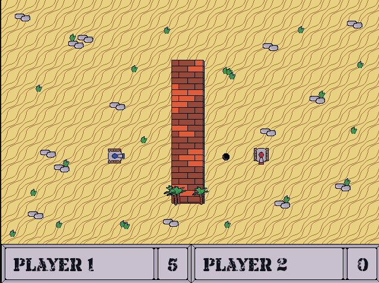

# Campo de Batalha (Battle field)

[Campo de Batalha on Itch.io](https://arthurmoreno.itch.io/campo-de-batalha)



This is my first game made from scratch done with SDL (1.2).
It was done as a first semester course at university. (07/06/2010)

Now a bit refactored from C to C++ and from SDL1.2 to SDL2.

## Preparing development

Install Gcc, Cmake, SDL2, SDL2 TTF and SDL2 Image on your target OS.

## Compiling

### Windows

Compiling with CMake:
```
make clean-win
make build-win
```

Copy necessary dlls
```
copy "C:/msys64/ucrt64/bin/libwinpthread-1.dll" "./build"
copy "C:/msys64/ucrt64/bin/libstdc++-6.dll" "./build"
copy "C:/msys64/ucrt64/bin/libgcc_s_seh-1.dll" "./build"
```

If you need to compile with gcc:
```
gcc main.c -o campo_de_batalha -IC:/msys64/ucrt64/include/SDL -LC:/msys64/ucrt64/lib -lmingw32 -lSDLmain -lSDL -lws2_32
```

### Linux

Building for development:

Compiling with CMake:
```
make clean
build-linux
```

Building for release:

```
make clean
build-linux-release
```

"Campo de Batalha - Linux v1.0.0.zip"