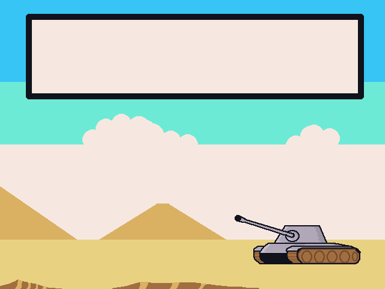

# Campo de Batalha (Battle field)



This is my first game made from scratch done with SDL (1.2).
It was done as a first semester course at university. (07/06/2010)

## Preparing development

Install Gcc, Cmake, SDL 1.2 on your target OS.

## Compiling

### Windows

Compiling with CMake:
```
make clean
make build
```

If you need to compile with gcc:
```
gcc main.c -o campo_de_batalha -IC:/msys64/ucrt64/include/SDL -LC:/msys64/ucrt64/lib -lmingw32 -lSDLmain -lSDL -lws2_32
```
